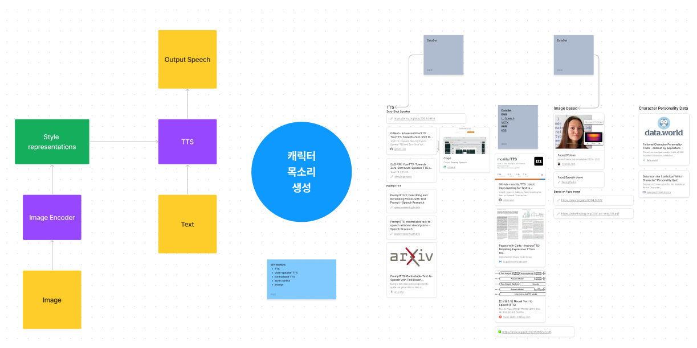

### 0. 조사 내용 공유 & 브레인스토밍

- 지난 회의에서 선정한 6개의 주제를 추가 조사 (09/22 ~ 09/20)
- 이후 figjam을 활용해 브레인스토밍하였음

### 1. 주제 선정
데이터 수집, 구현 난이도, 참신함, 팀원의 흥미도를 고려  
선정 주제: **캐릭터 목소리 생성 (Illust2Voice)**  
(위 주제로 1차 중간평가까지 진행 후, 구현 가능성 재평가)

### 2. 데이터 수집
- **캐릭터 이미지 - 대사 - 음성파일** 쌍으로 이루어진 데이터셋 필요.
- 다음 회의 전까지 **각각 캐릭터 10개, 총 50개**의 음성 파일 수집해오기
- 데이터 수집 과정 및 노하우를 파악 후 다음 회의 때 본격적인 데이터셋 구축 계획 수립.
- 서로 안 겹치게 분담: 효택-롤, 재현-GTA, 승호-APEX, 성진-오버워치

### 3. 자료 조사
- 가용한 TTS 데이터셋 조사
- TTS, Style control 등의 연구들 조사하기
- 현재 서비스 중인 TTS들의 페이지 및 UI 조사, 분석해오기

### 4. 추가 안건
- 기술 블로그 개설: 앞으로의 진행, 조사하고 공부한 내용들을 기록해서 포트폴리오 등에 활용하자

