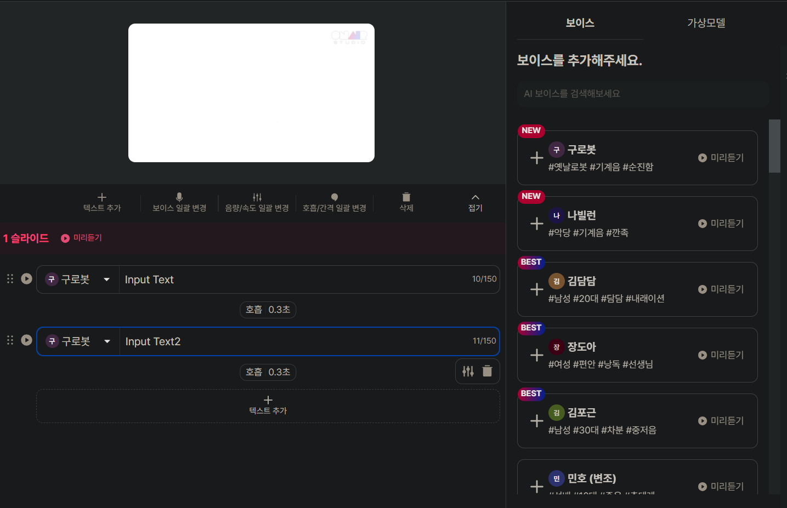
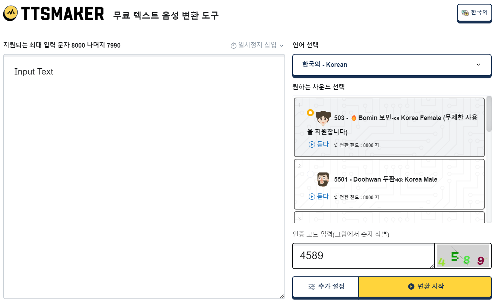
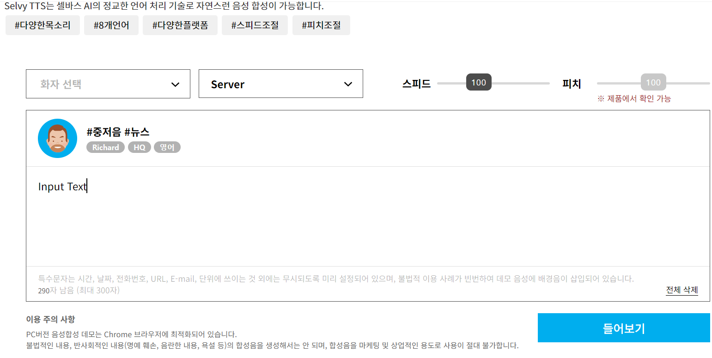
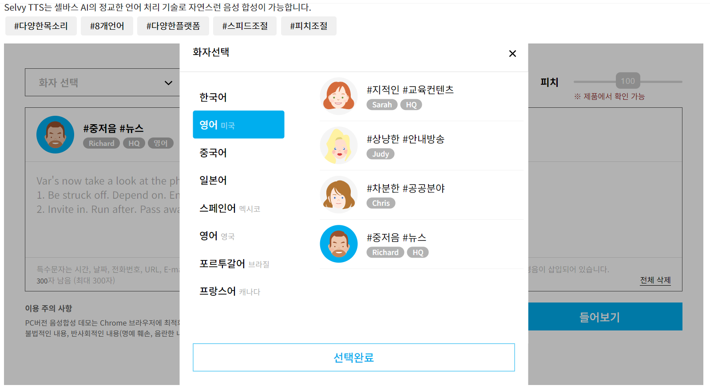

### 1. 팀소개

### 2. 아이디어 개요
* 아이디어 선정 이유
  * 개인화
    * 이미지 처리를 통해 사용자만이 유일하게 가질 수 있는 목소리 스타일을 만들 수 있음
* TTS 시장 규모 (효택)
* 현존 웹사이트
  
  * [Onairstudio](https://onairstudio.ai/, "Onairstudio")
  
  * [TTSMAKER](https://ttsmaker.com/ko, "TTSMAKER")
  
  * [SelvySpeech](https://speech.selvasai.com/text-to-speech-demonstration, "SelvySpeech")
  
  
* 활용 분야
    * 인디게임
    * 추가 예정
* 주요 이슈
  * 협업
  * 학습데이터 언어의 한계

### —본론—

1. 전체 아키텍쳐 (사용 기술 - 프레임워크, 언어, 런타임 etc..)
2. 웹 사이트 진행 흐름
   * 프론트 소개 (효택)
     * 프레임워크 사용 이유(장단점 ...)
   * 백엔드 소개 (승호)
     * 프레팀워크 사용 이유(Express.js)

    #### 웹사이트 파트
   * 자료조사 - 10/13(금)까지
   * PPT제작 - 10/15(일)까지

1. AI소개
    - 사전 기술, 전체 아키텍쳐, 주요 예상 문제, 데이터셋

### —결론—-

1. 협업 도구 / 스케줄 관리 얘기