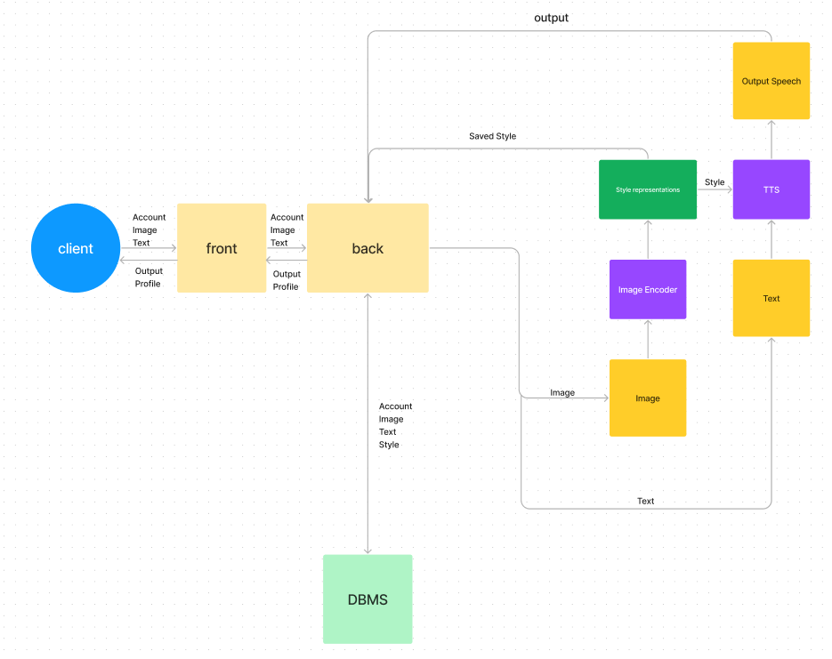
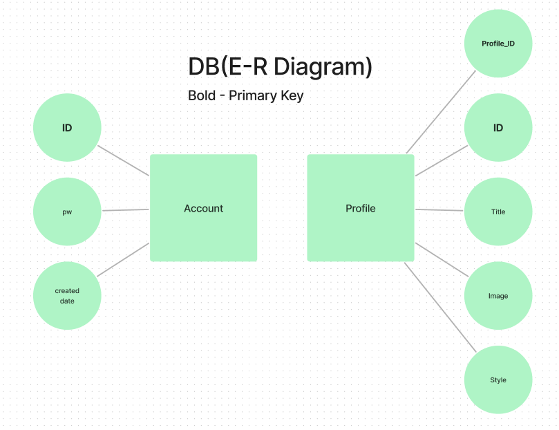

### 1. 흐름도

> 발표용으로 사용 시 FlowChart 기호에 맞게 변경 필요

#### 클라이언트
##### 비회원
  1. 이미지 업로드
  2. 반환된 스타일 받기
  3. 텍스트 입력
  4. TTS 받기
  >이미지와 텍스트를 동시에 입력받을 경우 UI가 조잡해질 가능성이 있음
  >TTS 입력창에서 스타일 저장 버튼을 클릭 시 회원가입 후 저장 가능

##### 회원
  1. 회원가입
  2. 비회원 1-4
  3. 반환된 스타일 저장 가능
  >Google Oauth 사용 시 클라이언트의 편의성 증가
 
#### 프론트 엔드
>
#### 백 엔드
- 프론트와 AI서버사이의 통신

>MySQL기준으로 만든 E-R 다이어그램이므로 MongoDB 사용 시 변경 필요
>스타일 테이블 생성 후 수정

##### 회원가입(Google Oauth 사용 시 흐름 파악 후 업데이트)
  1. 회원가입 정보 DB 저장

##### 로그인
  1. 로그인 정보 수신
  2. 로그인 정보가 DB에 저장되어있을 경우 로그인

##### AI API 호출
* Client to AI
  1. 수신 이미지를 이미지 처리 모델로 송신
  2. 텍스트를 TTS 모델로 송신
* AI to Client
  1. 이미지 처리 모델로부터 스타일 수신
  2. 스타일 DB에 저장
  3. TTS 처리 결과 송신

#### AI

